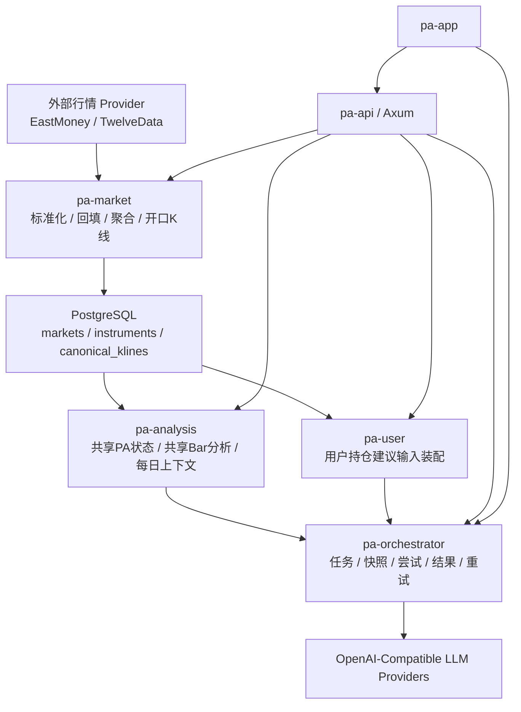
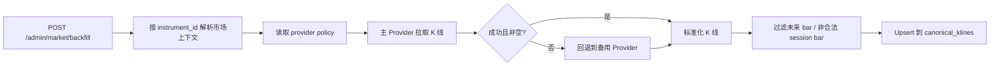

# oh-paa 项目调研与学习文档

日期：2026-04-23
项目：`oh-paa`
语言：中文

## 1. 项目定位

`oh-paa` 是一个基于 Rust workspace 的金融价格行为分析系统，目标不是做一个单纯的行情拉取服务，而是搭建一套完整的“市场数据底座 + 公共分析资产 + 用户个性化建议 + LLM 编排评估”平台。

从当前代码和设计文档来看，这个项目的核心目标可以概括为一句话：

构建一个面向 A 股、加密货币、外汇等多市场的、以标准化 K 线为基础、以价格行为分析为核心、以 LLM 结构化输出为执行引擎的分析系统。

它要解决的不是“怎么调一次模型”，而是下面四类长期问题：

- 如何把不同数据提供方的行情统一成系统内部可信的数据真相。
- 如何把共享市场分析和用户个性化建议严格分层，避免重复推理。
- 如何让 LLM 分析过程可追踪、可重放、可评估，而不是一次性黑盒调用。
- 如何逐步从研究型原型演进成可运行、可验证、可扩展的生产系统。

## 2. 项目价值主张

### 2.1 面向业务的价值

- 支持多市场：当前设计覆盖 A 股、加密、外汇，不再局限于单一市场。
- 支持多数据源：通过主/备 Provider 路由降低单一数据源风险。
- 支持共享分析复用：同一根 K 线或同一交易日的公共分析只做一次，所有用户复用。
- 支持用户差异化建议：在共享市场分析之上叠加用户持仓、订阅等上下文，生成个性化建议。
- 支持离线回放和在线质量评估：可以持续比较模型组合、提示词版本和输出质量。

### 2.2 面向工程的价值

- 强分层：市场数据、分析业务、用户业务、LLM 编排、API、运行时分 crate 管理。
- 强约束：大量结构化 JSON Schema 约束，减少 LLM 输出漂移。
- 可审计：任务、快照、尝试、结果、死信的模型已经明确。
- 可测试：不仅有单元测试，还有 API smoke test、live replay 测试、provider 解析测试。
- 可演进：设计上已经考虑未来的持久化编排、多市场扩展、质量门禁、生产 E2E 验证。

## 3. 整体架构概览

当前仓库是一个 Rust workspace，核心 crate 如下：

| crate | 角色 |
|---|---|
| `pa-core` | 配置、错误、时间周期等基础能力 |
| `pa-instrument` | 市场、标的、provider 绑定、provider policy 解析 |
| `pa-market` | 行情 provider 抽象、K 线标准化、回填、聚合、开口 K 线推导 |
| `pa-analysis` | 公共价格行为分析领域模型、任务构建、Prompt/Step 定义 |
| `pa-user` | 用户持仓建议领域模型、任务构建、Prompt/Step 定义 |
| `pa-orchestrator` | LLM 任务编排、执行器、Schema 校验、重试、死信、任务仓储抽象 |
| `pa-api` | Axum 路由层，暴露 admin/market/analysis/user API |
| `pa-app` | 运行时入口，加载配置、连接 PostgreSQL、注册 provider、启动 API 与 worker |

### 3.1 架构分层图

### 3.2 当前运行时状态

从当前实现看，项目处于“半生产底座 + 半实验分析层”的阶段：

- 市场数据链路已经接入 PostgreSQL，属于较真实的运行路径。
- 分析编排链路的数据模型和执行逻辑已经比较完整，但默认仓储仍是 `InMemoryOrchestrationRepository`，尚未真正持久化。
- LLM 评估和回放体系已经非常明显，说明团队当前研发重点不只是“功能能跑”，而是“质量是否稳定”。

## 4. 技术栈与关键依赖

- 语言：Rust 2024 edition
- Web 框架：Axum
- 异步运行时：Tokio
- 数据库：PostgreSQL
- 数据访问：SQLx
- 序列化：Serde / Serde JSON / TOML
- HTTP 调用：Reqwest
- JSON Schema 校验：`jsonschema`
- 日志：Tracing / tracing-subscriber
- 模型接入方式：OpenAI-Compatible API

关键配置集中在 `config.toml`，其中最重要的是两块：

- 行情 Provider 配置：`eastmoney`、`twelvedata`
- LLM 配置：provider、execution profile、step binding

这意味着项目将“模型是谁、哪个步骤用哪个模型”也做成了运行时可配置，而不是硬编码死在业务逻辑里。

## 5. 核心设计思想

### 5.1 Canonical First

系统强调 canonical data first，也就是：

- 上游 provider 数据不直接进入业务层。
- 所有业务逻辑都围绕内部统一的 `canonical_kline` 展开。
- 闭合 K 线才是业务真相，开口 K 线只是运行时推导视图。

这是一种很成熟的金融系统设计思路，因为它把“供应商返回什么”与“系统认为什么是真的”分离了。

### 5.2 Shared vs User 分层

系统将分析明确切分为两层：

- 共享层：面对市场本身，输出所有用户都能复用的公共分析资产。
- 用户层：叠加用户持仓、订阅、仓位状态，生成个性化建议。

这能显著降低重复计算，并避免把用户分析写成对原始行情的二次重构。

### 5.3 Task-Centered Orchestration

Phase 2 的核心不是“再写几个 prompt”，而是把 LLM 调用变成一类正式任务：

- 先创建任务
- 持久化输入快照
- 后台 worker 执行
- 做输出 JSON Schema 校验
- 记录 attempt / result / dead letter

这使项目从“调用模型”升级为“管理模型执行生命周期”。

### 5.4 Replay-Driven Quality

项目非常重视 replay：

- fixture replay：离线、确定性、可快速比较
- live historical replay：真实 provider 数据 + 真实模型调用
- 评分体系：`schema_hit_rate`、`cross_step_consistency_rate` 等

这说明项目把“分析质量稳定性”当成一级工程目标，而不是附加项。

## 6. 数据模型设计

### 6.1 基础市场数据模型

数据库迁移 `001_initial.sql` 对应 Phase 1 的核心数据结构：

- `markets`
- `instruments`
- `instrument_symbol_bindings`
- `provider_policies`
- `canonical_klines`

这些表共同表达了以下业务关系：

- 一个市场下有多个标的。
- 一个内部标的可以映射多个外部 provider symbol。
- provider policy 可以按市场或按标的配置。
- 统一存储的行情真相是 `canonical_klines`。

### 6.2 分析编排模型

数据库迁移 `002_phase2_analysis_orchestration.sql` 定义了分析编排的五类核心实体：

- `analysis_tasks`
- `analysis_snapshots`
- `analysis_attempts`
- `analysis_results`
- `analysis_dead_letters`

这套模型的意义很大：

- `task` 表示业务动作
- `snapshot` 固化执行输入
- `attempt` 记录每次模型调用
- `result` 保存最终结构化输出
- `dead_letter` 保存失败归档

如果后续把当前内存仓储替换成 PostgreSQL 仓储，这套模型基本就能成为正式生产编排层。

## 7. 业务流程设计

### 7.1 行情回填流程

这是目前最成熟的业务链路之一。

特点：

- 对上游 provider 失败有 fallback。
- 标准化后才落库。
- 只写闭合 bar。
- upsert 保证幂等。

### 7.2 市场读取与聚合流程

当前开放的市场侧 API 包括：

- `/market/canonical`
- `/market/aggregated`
- `/market/session-profile`
- `/market/tick`
- `/market/open-bar`

这意味着系统支持三种市场视图：

- 原始标准 K 线视图
- 更高周期聚合视图
- 实时开口 K 线视图

其中 `open-bar` 不是数据库真相，而是：

- 拉最新 tick
- 结合最近闭合子周期 bar
- 动态推导当前未完成 bar

这非常符合交易分析场景。

### 7.3 共享分析流程

共享分析不是一步，而是一个链式流程：

具体含义：

1. `shared_pa_state_bar`
   先把目标 bar 的 PA 状态抽出来，形成可复用状态层。
2. `shared_bar_analysis`
   基于共享 PA 状态，形成对单根 bar 的双向分析。
3. `shared_daily_context`
   汇总近期状态、多周期结构、近期共享分析，形成日级市场上下文。

这是一个很有意思的分层：

- 第一层更像“状态提取”
- 第二层更像“单 bar 解读”
- 第三层更像“日级策略背景”

### 7.4 用户分析流程

用户分析通过 `/user/analysis/manual` 触发，流程是：

关键约束：

- 用户分析不直接访问 provider。
- 用户分析依赖共享分析资产。
- 对闭合 bar 可去重，对开口 bar 允许重复执行。

这说明项目在业务边界上非常克制，避免用户分析层“越权”触碰行情真相层。

## 8. LLM 编排设计

### 8.1 Step Registry 模式

系统不是简单保存 prompt 字符串，而是定义了：

- `AnalysisStepSpec`
- `PromptTemplateSpec`
- `ModelExecutionProfile`
- `StepExecutionBinding`

对应关系是：

- Step 定义“这个分析步骤是什么、输出 schema 是什么”
- Prompt 模板定义“怎么提示模型”
- 执行 profile 定义“用哪个 provider/model/超时/重试”
- Binding 定义“哪个步骤绑定哪个执行 profile”

这是一种比较先进的模型治理方式。

### 8.2 为什么要拆成 Step + Prompt + Profile

这样拆分有几个明显好处：

- Prompt 版本和模型版本可以独立演进。
- 同一业务步骤可以切换不同模型 profile 做实验。
- 输出 schema 保持稳定，底层模型可以替换。
- replay 可以更容易比较“同一步骤在不同模型组合下的表现”。

### 8.3 结构化输出约束

项目对 LLM 输出格式要求非常严格。

例如共享 bar 分析要求固定顶层字段：

- `bar_identity`
- `bar_summary`
- `market_story`
- `bullish_case`
- `bearish_case`
- `two_sided_balance`
- `key_levels`
- `signal_bar_verdict`
- `continuation_path`
- `reversal_path`
- `invalidation_map`
- `follow_through_checkpoints`

这种设计体现了两个思想：

- 模型输出不是自由作文，而是结构化分析对象。
- 价格行为分析必须保留多空双路径，而不是单向观点。

### 8.4 重试与失败治理

Worker 的执行逻辑大致是：

1. claim 一个 pending task
2. 读取 snapshot
3. 按 prompt key/version 找到 step 定义
4. 构造 LLM request
5. 调模型
6. 校验输出 schema
7. 成功则落 result
8. 失败则根据错误类型决定 retry / failed / dead_letter

这意味着系统已经具备“任务编排器”的基本形态，而不只是业务函数。

## 9. 用户故事分析

### 9.1 管理员 / 运维人员

用户故事：

- 作为管理员，我希望配置市场、标的、provider 绑定和 provider policy，以便系统知道去哪里取数。
- 作为运维人员，我希望手动触发历史行情回填，以便把数据底座准备好。
- 作为运维人员，我希望查看 canonical/aggregated/open-bar/tick 接口，以验证运行时状态是否正常。

对应能力：

- `InstrumentRepository` 解析市场上下文
- `/admin/market/backfill`
- `/market/*` 系列接口

### 9.2 公共分析生产者

用户故事：

- 作为分析引擎，我希望在闭合 bar 出现后自动生成共享 PA 状态和共享 bar 分析。
- 作为市场研究模块，我希望每天生成共享 daily context，供后续用户分析复用。

对应能力：

- `build_shared_pa_state_bar_task`
- `build_shared_bar_analysis_task`
- `build_shared_daily_context_task`

### 9.3 持仓用户

用户故事：

- 作为有仓位的用户，我希望系统基于市场共享判断和我的持仓状态，生成更贴近执行的建议。
- 作为用户，我不希望建议脱离我自己的仓位、方向和风险控制上下文。

对应能力：

- `user_position_advice`
- `ManualUserAnalysisInput`
- `shared_daily_context_json + shared_bar_analysis_json + shared_pa_state_json + positions_json`

### 9.4 模型调优工程师

用户故事：

- 作为模型调优工程师，我希望对不同 prompt / model 组合做回放实验。
- 作为工程师，我希望用结构化指标判断哪个候选方案更稳定，而不是凭主观感觉。

对应能力：

- `replay_analysis`
- `replay_probe`
- `live historical replay`
- `schema_hit_rate`、`cross_step_consistency_rate` 等评分

## 10. 项目的核心创新点

### 10.1 将 PA 分析对象化

这个项目不是把市场分析写成一段自由文本，而是把分析拆成对象结构：

- 状态层
- 单 bar 层
- 日级上下文层
- 用户建议层

这使得分析结果更容易复用、比较、持久化和回放。

### 10.2 将 LLM 调用制度化

很多项目把模型调用写成：

- 拼 prompt
- 调接口
- 拿字符串

而这个项目已经进入下一个阶段：

- 明确步骤定义
- 明确输入快照
- 明确输出 schema
- 明确尝试记录
- 明确失败归类

这对于长期演进非常关键。

### 10.3 将“质量门”前置到研发流程

项目当前 TODO 的第一优先级不是继续堆功能，而是：

- 关闭 live replay quality gate
- 固化最终 baseline
- 多市场扩展 replay

这说明团队认识到：对 LLM 分析产品来说，“质量稳定”比“功能列表更长”更重要。

## 11. 当前阶段判断

综合代码、文档和 TODO，我认为该项目当前处于：

数据底座接近可用、分析编排基本成型、质量验证体系正在收口、生产级持久化和多市场扩展尚未完成的阶段。

可以更细地拆成四个层级：

### 11.1 已较成熟

- Rust workspace 分层
- PostgreSQL 市场数据模型
- provider 路由与 fallback
- canonical K 线回填与聚合
- API 路由基本成型
- replay 与 live replay 测试能力

### 11.2 已成型但仍偏过渡

- 分析任务模型
- step registry / execution profile
- worker 执行链
- 共享分析与用户分析的依赖装配

### 11.3 关键待补项

- 编排仓储从内存切换到持久化
- live replay 质量门真正闭环
- A 股 / 外汇的 live replay 覆盖
- 更完整的生产 E2E 验证

### 11.4 设计上已知限制

- 聚合仍偏 duration-based，尚未完全 session-calendar-aware
- 编排层尚未落真实数据库仓储
- 当前 live replay 仍主要覆盖 crypto 15m
- 模型输出虽有 schema 约束，但稳定性仍在继续打磨

## 12. 风险与挑战

### 12.1 技术风险

- LLM 结构化输出仍可能漂移，尤其是对象字段退化成字符串。
- 编排状态当前在内存中，进程重启后无法恢复。
- provider 的真实返回格式可能继续变化，解析层需要持续维护。

### 12.2 业务风险

- 多市场虽然已设计，但不同市场 session 规则差异大，后续复杂度会上升。
- 用户分析高度依赖共享分析质量，若上游共享分析不稳定，用户建议层会被放大污染。

### 12.3 工程复杂度风险

- crate 多、概念多，理解门槛较高。
- 如果后续继续增加 step 与模型组合，配置和评估矩阵会迅速膨胀。

## 13. 推荐学习路径

如果你要真正学会这个项目，我建议按下面顺序阅读。

### 第一步：先看设计文档，建立心智模型

建议顺序：

1. `docs/superpowers/specs/2026-04-21-financial-price-action-server-design.md`
2. `docs/superpowers/specs/2026-04-21-phase2-llm-analysis-orchestration-design.md`
3. `docs/architecture/phase1-runtime.md`
4. `docs/architecture/provider-db-e2e-test-plan.md`
5. `docs/TODO.md`

目标：

- 知道项目想做什么
- 知道已经做到哪里
- 知道当前最重要的短板是什么

### 第二步：理解运行时入口

重点阅读：

- `crates/pa-app/src/main.rs`
- `crates/pa-api/src/router.rs`
- `crates/pa-app/src/lib.rs`

目标：

- 明白应用启动时如何装配各模块
- 明白 API、worker、provider、数据库是如何连起来的

### 第三步：理解市场数据链路

重点阅读：

- `crates/pa-instrument/src/repository.rs`
- `crates/pa-market/src/provider.rs`
- `crates/pa-market/src/providers/twelvedata.rs`
- `crates/pa-market/src/providers/eastmoney.rs`
- `crates/pa-market/src/service.rs`
- `crates/pa-api/src/admin.rs`
- `crates/pa-api/src/market.rs`

目标：

- 看懂 instrument -> policy -> provider binding -> provider fetch -> normalize -> canonical write 的全过程

### 第四步：理解分析任务如何组装

重点阅读：

- `crates/pa-api/src/analysis_runtime.rs`
- `crates/pa-analysis/src/task_factory.rs`
- `crates/pa-user/src/task_factory.rs`
- `crates/pa-analysis/src/models.rs`
- `crates/pa-user/src/models.rs`

目标：

- 看懂共享分析输入是如何从市场数据拼出来的
- 看懂用户分析输入是如何依赖共享结果装配出来的

### 第五步：理解 LLM 编排执行器

重点阅读：

- `crates/pa-orchestrator/src/models.rs`
- `crates/pa-orchestrator/src/prompt_registry.rs`
- `crates/pa-orchestrator/src/executor.rs`
- `crates/pa-orchestrator/src/worker.rs`
- `crates/pa-orchestrator/src/repository.rs`

目标：

- 看懂 step registry、执行 profile、schema 校验、重试分类、结果持久化的机制

### 第六步：理解 Prompt 和输出契约

重点阅读：

- `crates/pa-analysis/src/prompt_specs.rs`
- `crates/pa-user/src/prompt_specs.rs`

目标：

- 看懂每个分析步骤的输入输出边界
- 看懂为什么项目如此强调 JSON schema 和字段稳定性

### 第七步：理解 replay 体系

重点阅读：

- `crates/pa-app/src/replay.rs`
- `crates/pa-app/src/replay_live.rs`
- `crates/pa-app/src/replay_score.rs`
- `crates/pa-app/tests/live_replay.rs`

目标：

- 看懂项目如何验证“模型是否真的更好”
- 看懂为什么当前 TODO 聚焦 live replay 质量门

## 14. 对项目未来演进的判断

我认为这个项目后续最合理的演进方向是：

### 14.1 短期

- 完成 live replay quality gate
- 固化当前最佳 step-model 组合
- 把编排仓储落到 PostgreSQL
- 形成可重复执行的生产 E2E 路径

### 14.2 中期

- 扩展到 A 股、外汇 live replay
- 增强 session-calendar-aware 聚合
- 完善调度触发与任务可观测性

### 14.3 长期

- 真正形成多市场、多模型、多步骤的分析平台
- 在共享分析之上发展更丰富的用户策略层
- 引入更稳定的线上评估与回归治理流程

## 15. 总结

`oh-paa` 不是一个简单的“行情接口 + AI 分析 demo”，而是一套正在成型的金融分析平台雏形。

它最值得学习的地方，不是某个函数怎么写，而是它体现出的四个工程思想：

- 用 canonical data 建立系统真相
- 用 shared/user 分层控制业务边界
- 用 task orchestration 管理 LLM 生命周期
- 用 replay 和 score 把模型质量纳入工程闭环

如果你要深入学习这个项目，最重要的是先建立“数据底座 -> 共享分析 -> 用户分析 -> 编排执行 -> 质量评估”这条主线。只要主线清楚，再回头看各个 crate，就不会觉得它只是一个目录很多的 Rust 仓库。

## 16. 参考文件

- `Cargo.toml`
- `config.example.toml`
- `migrations/001_initial.sql`
- `migrations/002_phase2_analysis_orchestration.sql`
- `docs/architecture/phase1-runtime.md`
- `docs/architecture/provider-db-e2e-test-plan.md`
- `docs/TODO.md`
- `docs/superpowers/specs/2026-04-21-financial-price-action-server-design.md`
- `docs/superpowers/specs/2026-04-21-phase2-llm-analysis-orchestration-design.md`
- `crates/pa-app/src/main.rs`
- `crates/pa-app/src/lib.rs`
- `crates/pa-app/src/replay.rs`
- `crates/pa-app/src/replay_live.rs`
- `crates/pa-app/src/replay_score.rs`
- `crates/pa-api/src/admin.rs`
- `crates/pa-api/src/market.rs`
- `crates/pa-api/src/analysis.rs`
- `crates/pa-api/src/analysis_runtime.rs`
- `crates/pa-api/src/user.rs`
- `crates/pa-analysis/src/models.rs`
- `crates/pa-analysis/src/prompt_specs.rs`
- `crates/pa-analysis/src/task_factory.rs`
- `crates/pa-user/src/models.rs`
- `crates/pa-user/src/prompt_specs.rs`
- `crates/pa-user/src/task_factory.rs`
- `crates/pa-market/src/service.rs`
- `crates/pa-market/src/provider.rs`
- `crates/pa-market/src/providers/twelvedata.rs`
- `crates/pa-market/src/providers/eastmoney.rs`
- `crates/pa-instrument/src/repository.rs`
- `crates/pa-orchestrator/src/models.rs`
- `crates/pa-orchestrator/src/prompt_registry.rs`
- `crates/pa-orchestrator/src/executor.rs`
- `crates/pa-orchestrator/src/worker.rs`
- `crates/pa-orchestrator/src/repository.rs`
- `crates/pa-app/tests/live_replay.rs`
- `crates/pa-api/tests/smoke.rs`
